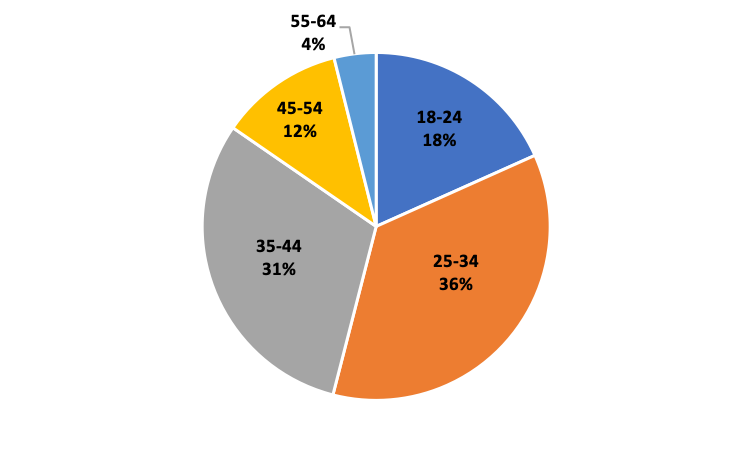

# Betterment- The first Robo-Advisor

## **Company's History**
The company chosen for this case study was Betterment. It was founded in August 2008 by Jonathan Stein, Sean Owen, Ryan O’Sullivan and Eli Broverman and launched in 2010 at TechCrunch Disrupt. Jonathan Stein earned a bachelor's degree in Economics from Harvard Univesrsity in 2001 and MBA from Columbia Business School in 2009. Jonathan founded Bettermen to address the challenges he encountered through managing his own investments. Betterment was created with the idea of simplyfing the complex investment landscape for its users by creating a platform that uses technology to provide personalized investment and money management advice to its customers.

   

[Image Source:1](#reference-1)

Betterment has raised $435 million over ten funding rounds from several investors. The latest round was on September 2021 for $160 million, leading to a total valuation of $1.3 billion. The growth capital was compromised of $60 million from a Series F equity round and $100 million from a debt financing round. The first funding round was in December 2010 for $3 million (Series A), followed by a series B equity run in October 2012 for $10 million, third round was in April 2014 for $32 million (Series C), fourth round was in February 2015 for $60 million (Series D), fifth round was in March 2016 for $100 million (Series E) and another series E equity run in July 2017 for $70 million. The investors of this company include: Kinnevik, Citi Ventures, Fransisco Partners and Alfac Global Ventures. Addittionaly,  Betterment has acquired 3 organizations, the latest being crypto manager Makara in February 2022. This last acquisition gave them the ability to add diversified crypto portfolios to their investments.[2](#reference-2)

## **Business Activities**

**What problem does Betterment solve?**  
Betterment is trying to make money and investment management simple and affordable. Investing and managing money can be a complex and overwhelming task for many people. Additionally, not only is it expensive to be able to afford a Financial advisor, but it typically requires a large minimum investment to open an account. By using technology, the company also mitigates behavioral and emotional biases when managing portfolios. The online platform allows customers to manage their investments on their own time without the need for in-person meetings, calls or paperwork.

**Company's customers**  
The company's intended customer varies from experienced to first time investors. The platform is designed to manage the investment process on behalf of the client via their robo-advisor. This innovative investment model takes the place of a traditional financial advisor by managing all the data analysis and executing investment strategies for each client based on their financial goals. Customers can still manage their own investment strategy to the extent they desire. Betterment won the Investopedia's best robo-advisors for beginners category due to its easy to use platform, its accesibility (allowing individuals to start investing with a minimum of $10), practical education resources, and intuitive guidance [3](#reference-3). As of April 30, 2023 Betterment's reported a customer count of 800,000+ and $36+ Billion in assets under management. [4](#reference-4)

**Market**  
According to Statista, assets under management in the robo-advisor industry in the US is expected to reach $1.7tn in 2023 and have an annual growh of 14.52% leading to a projected total amount of $2.02tn by 2027. Additionally, in 2021 the demographics of the robo-advisor industry was compromised of ~60% male and ~40% female. 52% of the users where reported to have high net income, 23% medium income and 25% low income. [5](#reference-5) The table below shows the age of users: 
  
The source of the content of this graph is Statista [5](#reference-5)

**Betterment's Competitive Advantage**

**How does Betterment's Robo-Advisor work?** 
Surprisingly, Betterment's robo-advisor does not use machine learning. After exploring the possiblity of using machine learning for portfolio generation, they found that the more simple approaches they were using were showing more effective results. The company's robo-advisor "involves a lot of math and statistical modeling with the crux depending on two different models averaged together" [6](#reference-6). In one of their techniques, Monte Carlo Simulations is used to simulate multiple market environments and creating portfolios for each of those scenarios. They then choose the better portfolio. The other model is based on Black-Litterman model. By using these models, they adapt the portfolios according to the customer's risk toletance, time-frame and financial goals. Consequently, they provide advice on the expected outcomes of the portfolios they generated for them. It is important to note that "even though Betterment doesn’t use machine learning widely, the technology does factor into some of its offerings". [6](#reference-6)

There are many programs that Betterment uses for developing models, algorithms and codes and for testing their software. Some of the programs and tools include [8](#reference-8): 
1. **Julia and Ruby:** the Quantitive Investment Team uses Julia to power projections and recommendations to the app and Ruby for the development of production code.
2. **Flutter:** used for their moblie application and used to create a [Charlatan](https://www.betterment.com/engineering/end-to-end-ish-tests-using-fake-http-in-flutter) a fake HTTP configuration to test software.
3. **WebValve:** is also used for testing software.
4. **Service Level Objevtive (SLO)**: to be able lo measure SLO Betterment uses some of this tools **StatsD** or **Micrometer** and **DataDog**.
5. **GitHub**
6. **CircleCI**: to provide CI/CD to the company's engineers.

## Landscape

* What domain of the financial industry is the company in?

* What have been the major trends and innovations of this domain over the last 5–10 years?

* What are the other major companies in this domain?

## Results

* What has been the business impact of this company so far?

* What are some of the core metrics that companies in this domain use to measure success? How is your company performing, based on these metrics?

* How is your company performing relative to competitors in the same domain?

## **Recommendations**

My recommendation would be offering another service where clients could integrate their external investments accounts to perform an overral analysis of their asset allocation. This could offer a better understading of their clients situation and goals and offer a better investment strategy. The investment strategy that Betterment would offer would take into account what their clients have outside their platform which would result in a more accurate recommendation on where to invest through them. For example, if a client has more equity overall in other platfoms the robo-advisor could recommend a portfolio containing more debt (always contemplating the clients goals, needs and risk tolerance). Offering this additional service could potentially benefit Betterment's overall market share and increase revenue. For this, the company could use exsisting algorithms and engineered models as it is currently using for analysing and creating portfolios. The process of integrating this new service would employ similar data analysis as it does for integrating portfolios. The robo-advisor would take into account the values of the extetrnal accounts and the category as a new variable along with the other variables it currently uses to create, adjust and reallocate portfolios. 

Additionally, I would recommend the company to explore the possibility of offering mutual funds to make it more competitive with other companies. 

## Addendum

### Reference 1
Stein, J. (2016, July 25). The history of betterment: How we started a company that is changing an industry. LinkedIn. https://www.linkedin.com/pulse/history-betterment-how-we-started-company-changing-industry-stein/ 

### Reference 2
* Editors, B. (2022, October 18). Betterment raises $160 million in Growth Capital. Betterment. https://www.betterment.com/resources/2021-fundraising 
* Betterment - Crunchbase Company Profile &amp; Funding. Crunchbase. (n.d.). https://www.crunchbase.com/organization/betterment 
* Massa, A. (2021, September 29). Betterment valuation rises to $1.3 billion on funding round. Bloomberg.com. https://www.bloomberg.com/news/articles/2021-09-29/betterment-valuation-rises-to-1-3-billion-on-new-funding-round 
* Nasr, T. (2023, May 26). Betterment statistics (2023): AUM, users, revenue, &amp; more. Investing in the Web. https://investingintheweb.com/brokers/betterment-statistics/#:~:text=As%20of%20April%2030%2C%202023,on%20behalf%20of%20its%20clients. 

### Reference 3
Sette, M. L. (2023, May 1). Best robo-advisors. Investopedia. https://www.investopedia.com/best-robo-advisors-4693125 

### Reference 4
Making people’s lives better. About Betterment. (n.d.). https://www.betterment.com/about 

### Reference 5
Robo-advisors - united states: Statista market forecast. Statista. (n.d.). https://www.statista.com/outlook/dmo/fintech/digital-investment/robo-advisors/united-states 

### Reference 6
Field, H. (2022, October 11). Why betterment’s robo-advisor doesn’t use AI. Emerging Tech Brew. https://www.emergingtechbrew.com/stories/2022/10/11/why-betterment-s-robo-advisor-doesn-t-use-ai 

### Reference 7
Felicetta, D. (2021, November 14). Why (and how) betterment is using julia. Betterment. https://www.betterment.com/engineering/why-betterment-is-using-julia 

### Reference 8
* Felicetta, D. (2021, November 14). Why (and how) betterment is using julia. Betterment. https://www.betterment.com/engineering/why-betterment-is-using-julia 
* Moore, S. (2022a, February 23). End-to-end-ish tests using fake HTTP in flutter. Betterment. https://www.betterment.com/engineering/end-to-end-ish-tests-using-fake-http-in-flutter 
* Russell, S. (2021a, August 4). Focusing on what matters: Using slos to pursue User Happiness. Betterment. https://www.betterment.com/engineering/service-level-objectives-slo 
* Mileham, J. (2018, October 23). CI/CD: Shortening the feedback loop. Betterment. https://www.betterment.com/engineering/ci-cd-shortening-the-feedback-loop 
* Dev Community (2022, Jan 21) The Incremental Flutter Migration - Flutter NYC December Meetup (Pt 2). https://youtu.be/e6ncTlHSlUE